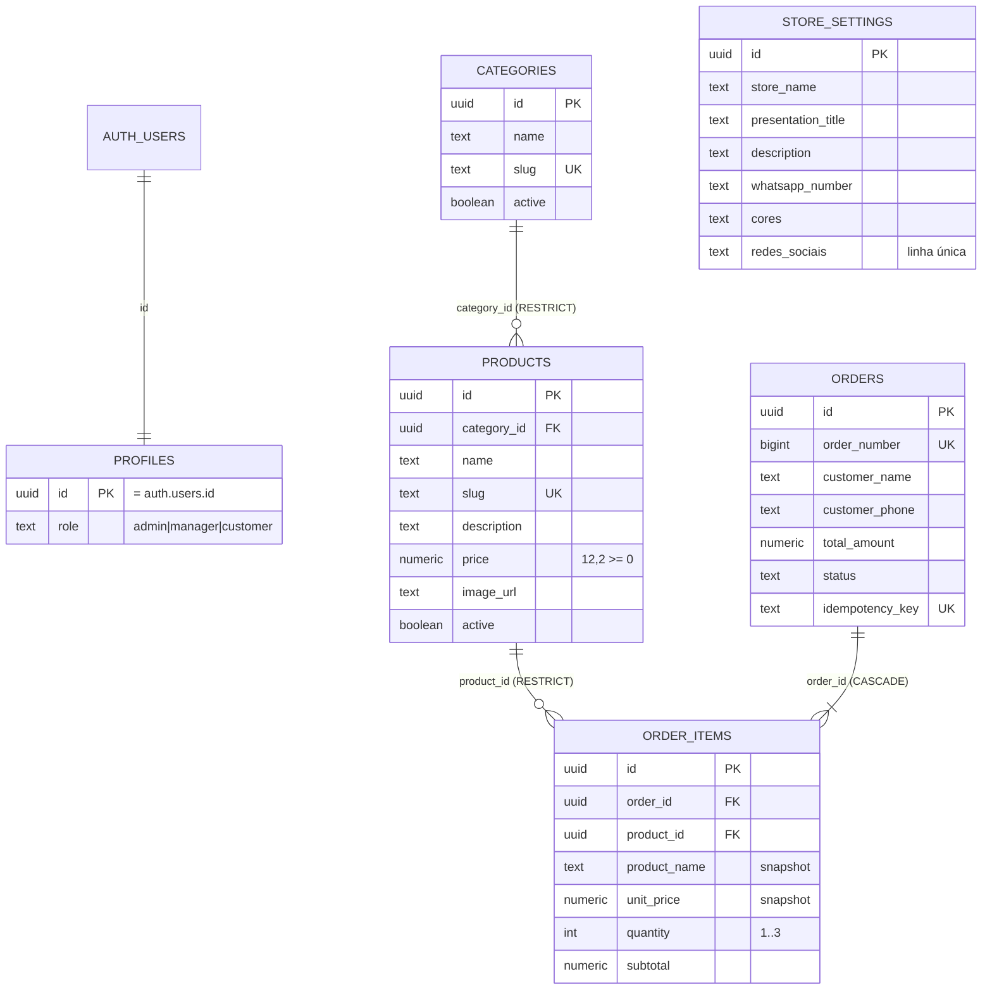

# Catálogo de Semijoias — Proposta de Arquitetura (Fase 0, aguardando aprovação)

> Status: **proposta**. Nada de Next.js foi gerado ainda. As migrations SQL (001–011) já foram
> escritas e **validadas em PostgreSQL** com um stub do ambiente Supabase + 40 testes de regras
> (quantidade, idempotência, snapshot, RLS, storage, URLs maliciosas) — todos passando.
> Arquivos em `supabase/migrations/` e `supabase/tests/`.

---

## 1. Arquitetura geral

```
Navegador (React/Tailwind)
   │  só envia: product_id + quantity + dados do cliente + idempotency_key
   ▼
Next.js (App Router) ── Server Components (leitura)  ── Server Actions (escrita)
   │
   ▼
src/lib/services/*  (regras de negócio: product, category, order, store-settings)
   │                 valida com Zod, checa autorização (requireAdmin)
   ▼
Supabase client
   ├─ cliente "sessão do usuário" (anon key + cookies) → RLS se aplica  [leitura pública + admin]
   └─ cliente "service role" (só servidor)            → apenas create_order()
   ▼
PostgreSQL (constraints + RLS + função transacional create_order)
```

Três camadas de defesa para cada regra crítica:

| Regra                          | Frontend (UX)          | Servidor (Zod/Service)                     | Banco (fonte final)                               |
| ------------------------------ | ---------------------- | ------------------------------------------ | ------------------------------------------------- |
| 1 ≤ quantidade ≤ 3 por produto | botões +/- travados    | `quantity: z.number().int().min(1).max(3)` | `CHECK (quantity between 1 and 3)`                |
| Mesmo produto 2× no payload    | carrinho agrupa por id | Zod rejeita duplicados                     | `UNIQUE (order_id, product_id)`                   |
| Preço/total                    | só exibe               | ignora qualquer preço recebido             | `create_order()` lê `products.price` e calcula    |
| Produto ativo                  | esconde                | —                                          | `create_order()` exige produto e categoria ativos |
| Status válido                  | select fixo            | `z.enum([...])`                            | `CHECK (status in (...))`                         |
| Admin                          | esconde menu           | `requireAdmin()` em toda action            | RLS `is_admin()`                                  |
| URL social segura              | `type=url`             | Zod: só `https:` + domínio da rede         | `CHECK (... ~* '^https://')`                      |

---

## 2. Diagrama de entidades



The additive migration `20261007001200_add_presentation_title.sql` adds the editable homepage
presentation title. Migration `20261007001300_allow_presentation_asset_upload.sql` lets admins
upload presentation images to Storage, and `20261007001400_convert_presentation_image_to_gallery.sql`
stores up to three image URLs for the homepage carousel. The existing `description` field supplies
the supporting text; these fields are managed in `/admin/configuracoes`.

`store_settings` não se relaciona com nada — é uma linha única (garantida por `UNIQUE INDEX ((true))`).

---

## 3. Tabelas, constraints e índices (resumo — SQL completo no Apêndice)

**Adições em relação à especificação original** (cada uma precisa da sua aprovação):

1. `orders.order_number BIGINT GENERATED ALWAYS AS IDENTITY UNIQUE` — o "#123" da mensagem do WhatsApp. UUID é ótimo como PK mas péssimo para o cliente ditar ao atendente. Trade-off: número sequencial revela volume aproximado de pedidos e pode ter "buracos" (tentativas que deram ROLLBACK consomem o número) — aceitável.
2. `idempotency_key NOT NULL` (spec dizia só `UNIQUE`). Todo pedido nasce do checkout, então sempre tem chave.
3. `UNIQUE (order_id, product_id)` em `order_items` — sem isso, `[{A,3},{A,3}]` burlaria o limite de 3.
4. `CHECK (subtotal = unit_price * quantity)` — o banco recusa itens com conta errada.
5. Limites de tamanho (`char_length`) em nome, nota (500), descrição; formato de slug; telefone só dígitos; cores `#RRGGBB`; WhatsApp só dígitos com DDI.
6. `profiles.role` com **default `customer`** + trigger que cria o profile ao criar usuário no Auth. Admin é promovido manualmente por SQL. Assim, mesmo que alguém consiga se cadastrar, **não vira admin**.

**Chaves estrangeiras**

| FK                                | ON DELETE | Motivo                                                                                          |
| --------------------------------- | --------- | ----------------------------------------------------------------------------------------------- |
| products.category_id → categories | RESTRICT  | "excluir categoria quando permitido" = sem produtos. Senão, desativar.                          |
| order_items.product_id → products | RESTRICT  | Produto que já foi vendido não pode sumir; admin deve **desativar**. A UI mostra essa mensagem. |
| order_items.order_id → orders     | CASCADE   | Itens não existem sem o pedido.                                                                 |
| profiles.id → auth.users          | CASCADE   | Usuário removido do Auth leva o profile.                                                        |

**Índices** (só os que têm consulta real):

| Índice                                             | Consulta que atende                             |
| -------------------------------------------------- | ----------------------------------------------- |
| `categories.slug`, `products.slug` (via UNIQUE)    | `/categoria/[slug]`, `/produtos/[slug]`         |
| `categories(active)`                               | menu/vitrine pública                            |
| `products(category_id)`                            | listagem por categoria + FK                     |
| `products(created_at desc) WHERE active` (parcial) | vitrine pública "mais recentes"                 |
| `orders(status)`, `orders(created_at desc)`        | painel de pedidos (filtro + ordenação)          |
| `order_items(order_id, product_id)` (via UNIQUE)   | itens do pedido (cobre `order_id`)              |
| `order_items(product_id)`                          | FK RESTRICT ao excluir produto (evita seq scan) |
| `profiles.id` (PK), `profiles(role)`               | `is_admin()`                                    |

`products(active)` sozinho foi trocado pelo índice parcial (boolean puro tem baixa seletividade).

---

## 4. RLS e policies

Helper: `public.is_admin()` — `SECURITY DEFINER`, `search_path = ''`, lê `profiles` para `auth.uid()`. É `SECURITY DEFINER` para evitar recursão de RLS em `profiles`.

| Tabela         | anon (público)                        | authenticated comum | admin                                                              |
| -------------- | ------------------------------------- | ------------------- | ------------------------------------------------------------------ |
| categories     | SELECT `active`                       | igual anon          | CRUD                                                               |
| products       | SELECT `active` **e categoria ativa** | igual anon          | CRUD                                                               |
| store_settings | SELECT                                | SELECT              | SELECT, UPDATE (sem INSERT/DELETE — linha única)                   |
| orders         | **nada**                              | nada                | SELECT, UPDATE **só da coluna `status`** (`GRANT UPDATE (status)`) |
| order_items    | nada                                  | nada                | SELECT (imutável)                                                  |
| profiles       | nada                                  | SELECT do próprio   | SELECT todos; **ninguém** altera role via API                      |

Defesa em profundidade: além das policies, `REVOKE INSERT/UPDATE/DELETE` dos papéis `anon`/`authenticated` onde não há escrita legítima — se alguém criar uma policy errada no futuro, o GRANT ainda bloqueia.

`store_settings`: hoje todas as colunas são públicas por natureza (o número do WhatsApp aparece no site). Se surgir coluna sensível, trocar o SELECT público por uma VIEW com as colunas permitidas.

---

## 5. Criação transacional do pedido (`create_order`)

**Problema:** criar `orders` + N `order_items` sem nunca deixar pedido sem itens ou com itens parciais, sem confiar no preço do cliente, e sem duplicar em duplo clique.

**Opções:**

- (a) Várias chamadas `supabase.from().insert()` a partir do Node — o supabase-js/PostgREST **não abre transação entre chamadas**; uma falha no meio deixa pedido órfão.
- (b) Conexão Postgres direta (`pg`/Drizzle) com `BEGIN/COMMIT` no Node — funciona, mas adiciona pool de conexões, outra credencial e outra lib.
- (c) **Função PL/pgSQL chamada via `supabase.rpc('create_order')`** — a função inteira roda em uma única transação; qualquer `RAISE` = ROLLBACK automático.

**Decisão:** (c). **Trade-off:** parte da regra de negócio fica em SQL (precisa de testes de banco — já escritos em `supabase/tests/rules_test.sql`).

O que a função faz, em ordem:

1. Valida o array (1 a 50 itens distintos).
2. `INSERT ... ON CONFLICT (idempotency_key) DO NOTHING` — se a chave já existe, retorna o pedido existente com `created = false`.
3. Insere os itens com `JOIN products ... AND active JOIN categories ... AND active FOR SHARE`, pegando **nome e preço do banco** (snapshot). `FOR SHARE` impede que o admin mude o preço no meio da transação.
4. Se o nº de itens inseridos ≠ nº pedido → `PRODUCT_UNAVAILABLE` (inexistente, inativo ou categoria inativa) → ROLLBACK.
5. `total_amount = SUM(subtotal)` calculado em `NUMERIC` (sem erro de ponto flutuante do JS).

Permissão: `EXECUTE` **revogado** de `anon`/`authenticated`, concedido só a `service_role`. O único caminho é: Server Action → `order.service.ts` → cliente service role. O navegador não consegue chamar a RPC nem com a anon key.

### Fluxo completo

```
[Checkout] gera idempotency_key = crypto.randomUUID() (guardada em sessionStorage junto do carrinho)
   │ botão "Finalizar pedido" desabilita no 1º clique (useFormStatus/useTransition)
   ▼
Server Action createOrderAction(formData)
   ├─ Zod CreateOrderSchema: nome, telefone BR → normaliza p/ dígitos, nota ≤ 500,
   │   items[1..50] {product_id: uuid, quantity: 1..3}, sem product_id repetido
   ├─ (honeypot anti-bot)
   ▼
order.service.createOrder()
   ├─ supabase(service role).rpc('create_order', {...})   ← transação única no Postgres
   ├─ busca o pedido + itens (snapshot) para montar a mensagem
   └─ lib/whatsapp: monta texto + URL https://wa.me/<store_settings.whatsapp_number>?text=<encodeURIComponent>
   ▼
retorna { orderNumber, whatsappUrl }  (nunca dados de outros pedidos)
   ▼
[Cliente] limpa carrinho + chave → tela "Pedido #123 registrado" → window.location.href = whatsappUrl
          (com botão "Abrir WhatsApp" de fallback)
```

Por que `location.href` e não `window.open`: `window.open` depois de um `await` é bloqueado como pop-up no Safari iOS. A tela de sucesso com botão garante que o cliente sempre consegue abrir.

Por que **não** existe página pública `/pedido/[id]`: ela exporia nome e telefone para quem tiver o link. O resumo fica só na memória da tela de sucesso e na mensagem do WhatsApp.

---

## 6. Idempotência

| Cenário                             | O que acontece                                                                                       |
| ----------------------------------- | ---------------------------------------------------------------------------------------------------- |
| Duplo clique                        | botão desabilita; se 2 requests chegarem, ambos usam a **mesma chave** → 1 pedido                    |
| Duas requests simultâneas           | o índice UNIQUE serializa: a 2ª espera o COMMIT da 1ª e cai no `DO NOTHING` → retorna o mesmo pedido |
| Refresh / rede caiu após criar      | chave está no sessionStorage → reenvio devolve o pedido existente e a mesma URL do WhatsApp          |
| Cliente quer fazer **outro** pedido | após sucesso a chave é descartada; nova chave = novo pedido                                          |

Limitação conhecida (MVP): se a mesma chave for reenviada com carrinho diferente, devolve o pedido original. Evolução possível: guardar `request_hash` e rejeitar divergência.

---

## 7. WhatsApp

- `lib/whatsapp/build-order-message.ts`: função pura (testável) que recebe o pedido **lido do banco** e gera o texto do modelo da especificação; valores com `Intl.NumberFormat('pt-BR', { style: 'currency', currency: 'BRL' })`; telefone formatado `(21) 99999-9999`.
- Número **sempre** de `store_settings.whatsapp_number` (dígitos com DDI, validado por CHECK + Zod).
- URL: `https://wa.me/${numero}?text=${encodeURIComponent(texto)}`.
- Nota do cliente: removidos caracteres de controle, limite 500 (mensagens muito longas quebram em alguns apps).

---

## 8. Redes sociais

- 3 campos opcionais usados pela aplicação em `store_settings`: Instagram, Facebook e TikTok. `SocialLinksSchema` (Zod) por campo: string vazia → `null`; `new URL()` válido; `protocol === 'https:'`; hostname na allowlist da rede (`instagram.com`, `facebook.com`/`fb.com`, `tiktok.com`, com `www.` opcional). As colunas antigas de YouTube e LinkedIn permanecem no banco por compatibilidade, mas não são editadas nem exibidas.
- Banco: `CHECK (... ~* '^https://')` como última barreira (`javascript:`, `data:`, `http:` recusados — testado).
- `<SocialLinks>` filtra os nulos → só renderiza os configurados; links com `target="_blank" rel="noopener noreferrer"` e `aria-label`.

---

## 9. Autenticação (Supabase Auth)

- Login por e-mail/senha em `/admin/login`. **Desativar "Allow new users to sign up"** no painel do Supabase — admin é criado manualmente (Dashboard → Auth → Add user) e promovido: `update profiles set role='admin' where id='...'`.
- `@supabase/ssr` com cookies. Três camadas:
  1. `middleware.ts`: atualiza sessão e redireciona `/admin/*` (exceto `/admin/login`) sem usuário → `/admin/login`. É **só UX** (houve CVE de bypass de middleware no Next.js, CVE-2025-29927).
  2. `app/admin/(protected)/layout.tsx`: `requireAdmin()` no servidor — `supabase.auth.getUser()` (valida o JWT no Supabase; **não** `getSession()`, que só lê o cookie) + `role = 'admin'`. Usuário logado sem role admin → página 403.
  3. **Toda Server Action admin chama `requireAdmin()` de novo** — Server Actions são endpoints POST públicos, podem ser chamadas sem passar pelo layout. E mesmo assim o RLS bloqueia no banco.
- As operações admin usam o cliente **com a sessão do usuário** (não service role), então o RLS é a defesa final.

---

## 10. Storage

| Bucket                               | Público (leitura por URL) | Tipos                 | Limite | Upload                     |
| ------------------------------------ | ------------------------- | --------------------- | ------ | -------------------------- |
| `product-images`                     | sim                       | jpeg, png, webp, avif | 5 MB   | só admin                   |
| `store-assets` (`logo/`, `favicon/`) | sim                       | jpeg, png, webp, ico  | 2 MB   | só admin, só nessas pastas |

- **SVG proibido**: SVG pode conter `<script>` (XSS).
- Sem policy de SELECT para anon em `storage.objects`: a URL pública funciona, mas ninguém lista o conteúdo do bucket.
- Upload feito via Server Action (valida tipo/tamanho com Zod antes) → nome do arquivo gerado no servidor (`<uuid>.<ext>`), nunca o nome enviado pelo usuário.
- `next.config` → `images.remotePatterns` liberando só o host do projeto Supabase.

---

## 11. Variáveis de ambiente

```
# .env.example
NEXT_PUBLIC_SUPABASE_URL=
NEXT_PUBLIC_SUPABASE_ANON_KEY=
SUPABASE_SERVICE_ROLE_KEY=
NEXT_PUBLIC_SITE_URL=          # para sitemap/Open Graph/metadataBase
```

- `lib/supabase/admin.ts` (service role) começa com `import 'server-only'` → o build **falha** se algum Client Component importá-lo.
- `.env.local` no `.gitignore`. Nada de `NEXT_PUBLIC_*SERVICE_ROLE*`.

---

## 12. Estrutura de pastas

```
src/
├── app/
│   ├── (public)/
│   │   ├── layout.tsx                 # Header/Footer com store_settings
│   │   ├── page.tsx                   # home
│   │   ├── produtos/page.tsx
│   │   ├── produtos/[slug]/page.tsx
│   │   ├── categoria/[slug]/page.tsx
│   │   ├── carrinho/page.tsx
│   │   └── checkout/page.tsx
│   ├── admin/
│   │   ├── login/page.tsx
│   │   └── (protected)/               # layout com requireAdmin()
│   │       ├── layout.tsx
│   │       ├── dashboard/  produtos/  categorias/  pedidos/  configuracoes/
│   ├── sitemap.ts   robots.ts   layout.tsx   not-found.tsx
├── components/  catalog/ cart/ checkout/ admin/ layout/ ui/
├── lib/
│   ├── supabase/   server.ts  browser.ts  admin.ts(server-only)  middleware.ts
│   ├── services/   product.service.ts  category.service.ts  order.service.ts  store-settings.service.ts
│   ├── actions/    (Server Actions finas: Zod → requireAdmin → service)
│   ├── auth/       require-admin.ts
│   ├── validations/ order.ts product.ts category.ts store-settings.ts social-links.ts phone.ts
│   ├── whatsapp/   build-order-message.ts  build-whatsapp-url.ts
│   └── format/     currency.ts  phone.ts
├── types/          database.types.ts (gerado: supabase gen types)
└── hooks/          use-cart.ts
middleware.ts
supabase/ migrations/  seed.sql  tests/
docs/architecture.md
```

Carrinho: Context + `useReducer` + `localStorage` (sem lib extra). Guarda só `{product_id, quantity}`; nome/preço exibidos são buscados do servidor na página do carrinho (evita preço velho na tela).

---

## 13. Principais riscos de segurança e mitigação

| Risco                                        | Mitigação                                                                                                                                   |
| -------------------------------------------- | ------------------------------------------------------------------------------------------------------------------------------------------- |
| Manipulação de preço/total                   | servidor ignora; `create_order` usa `products.price`                                                                                        |
| Quantidade > 3 / mesmo item repetido         | Zod + CHECK + UNIQUE(order_id, product_id)                                                                                                  |
| Produto inativo comprado por id antigo       | `create_order` exige produto e categoria ativos                                                                                             |
| Pedido duplicado                             | idempotency_key UNIQUE + ON CONFLICT                                                                                                        |
| Pedido órfão / parcial                       | função transacional (ROLLBACK)                                                                                                              |
| Vazamento da service role                    | `server-only`, sem `NEXT_PUBLIC_`, uso restrito a `order.service`                                                                           |
| Escalada para admin                          | signup desativado, role default `customer`, sem policy de UPDATE em profiles                                                                |
| Acesso admin sem auth (bypass de middleware) | `requireAdmin()` no layout **e** em cada action + RLS                                                                                       |
| Ler pedidos de terceiros (PII)               | sem policy anon em orders/order_items; sem página pública de pedido                                                                         |
| XSS via URL social / logo                    | Zod https + allowlist; CHECK no banco; sem SVG no storage; React escapa texto                                                               |
| Spam de pedidos (bot)                        | **MVP:** honeypot + limite de 50 itens + tamanhos; **evolução:** Cloudflare Turnstile ou rate limit por IP numa tabela Postgres — sem Redis |
| CSRF em Server Actions                       | Next.js já compara `Origin` x `Host` em Server Actions                                                                                      |
| Enumeração de pedidos                        | PK UUID; `order_number` só aparece na mensagem do próprio cliente                                                                           |

---

## 14. Decisões arquiteturais (Problema → Opções → Decisão → Motivo → Trade-offs)

**Next.js (App Router).** Problema: catálogo público precisa de SEO + painel admin + backend. Opções: SPA + API separada; Next.js. Decisão: Next.js. Motivo: SSR/ISR para SEO, Server Actions como backend no mesmo deploy, um único repositório. Trade-off: acoplamento ao ecossistema Next/Vercel; Server Actions exigem disciplina de autorização (são endpoints públicos).

**Supabase/PostgreSQL.** Problema: banco relacional + auth + arquivos sem operar infraestrutura. Opções: Postgres próprio + Auth.js + S3; Firebase; Supabase. Decisão: Supabase. Motivo: Postgres de verdade (constraints, transações, RLS), Auth e Storage integrados ao RLS. Trade-off: parte da segurança mora em policies SQL, que precisam de testes próprios.

**Monólito modular.** Problema: organizar o código sem complexidade operacional. Decisão: um app, módulos por domínio (`services/`, `validations/`). Motivo: 1 loja, baixo volume, 1 desenvolvedor — microsserviços trariam rede, deploy e consistência distribuída sem benefício. Trade-off: escala vertical/serverless apenas; extração futura é possível porque a lógica já está separada em services.

**Preço calculado no servidor/banco.** Qualquer dado vindo do navegador é controlável pelo usuário (DevTools, curl). Trade-off: se o preço muda entre adicionar ao carrinho e finalizar, o cliente paga o novo preço — a tela de sucesso e a mensagem mostram o valor real.

**Snapshot em order_items.** Pedido é um documento histórico; `JOIN products` mostraria o preço de hoje. Trade-off: duplicação intencional de nome/preço.

**Pedido criado antes do WhatsApp.** O WhatsApp está fora do nosso controle (aba fechada, sem app, sem rede). O banco é a fonte da verdade; o admin vê o pedido `pending` mesmo que a mensagem nunca chegue. Trade-off: haverá pedidos `pending` "abandonados" — o admin marca como `cancelled`.

**Idempotência.** Redes móveis falham e usuários clicam duas vezes; sem chave, cada retry vira pedido. Trade-off: chave gerenciada no cliente (sessionStorage).

**RLS.** A anon key é pública por definição; sem RLS, qualquer um com ela lê/escreve tudo via PostgREST. RLS garante a regra mesmo se o código Next tiver um bug. Trade-off: policies precisam ser testadas (feito).

**Sem estoque no MVP.** Semijoias de catálogo com venda finalizada no WhatsApp: o atendente confirma disponibilidade. Estoque agora = complexidade de concorrência sem necessidade.

**Estoque no futuro (seguro).** Nunca "ler → if → escrever" (condição de corrida: dois clientes leem estoque 3, ambos compram 3). Fazer dentro de `create_order`, atomicamente:

```sql
update public.products set stock = stock - v_qty
 where id = v_product_id and stock >= v_qty;
get diagnostics v_rows = row_count;
if v_rows = 0 then raise exception 'OUT_OF_STOCK'; end if;  -- ROLLBACK do pedido inteiro
```

O `UPDATE` adquire lock de linha; o 2º cliente espera, reavalia `stock >= v_qty` e falha. Mais `CHECK (stock >= 0)` como garantia final. A função já está estruturada para receber esse passo.

**Sem Redis/Kafka/microsserviços.** Problemas que eles resolvem (cache distribuído, filas de alto volume, escala independente) não existem aqui. Postgres resolve idempotência (UNIQUE), transação e até rate limit simples. Adicionar = mais custo, operação e pontos de falha.

---

## 15. Pontos que precisam da sua decisão

1. **Adições ao schema** da seção 3 (`order_number`, `idempotency_key NOT NULL`, UNIQUE, limites de tamanho, role default `customer`).
2. **Excluir produto já vendido:** proposta = bloquear (RESTRICT) e orientar a desativar. Alternativa: soft delete (`deleted_at`).
3. **Seed:** a spec pede `011_seed.sql` como migration, mas migrations rodam também em **produção** (criariam produtos de teste lá). Proposta: mover para `supabase/seed.sql` (roda só em `supabase db reset` local), mantendo a linha inicial de `store_settings` numa migration.
4. **Nome dos arquivos de migration:** o Supabase CLI gera `20261006120000_create_profiles.sql` (timestamp). Proposta: seguir a convenção da CLI (timestamp) mantendo os mesmos nomes e ordem (`create_profiles`, `create_categories`, ...). Manter `001_...` também funciona, mas foge da convenção.
5. **Produtos de categoria inativa** ficam ocultos e não podem ser pedidos (proposto) — ok?
6. **Imagem:** 1 imagem por produto (spec). Galeria (`product_images`) fica para depois?
7. **Ambiente:** você já tem projeto Supabase criado? Para desenvolvimento proponho Supabase CLI local (Docker) + projeto na nuvem para produção. Deploy: Vercel?

---

## 16. Plano de testes (Etapa 16)

- **Banco (pgTAP / `supabase test db`):** o `supabase/tests/rules_test.sql` atual já cobre 40 casos e será portado para pgTAP.
- **Unitários (Vitest):** schemas Zod (quantidade 1/2/3 ok; 4/0/-1 erro; telefone BR; URLs `javascript:`/`data:`/`http:`/domínio errado), `build-order-message`, formatação BRL.
- **Integração (Vitest + Supabase local):** `order.service.createOrder` (válido, inexistente, inativo, preço alterado, idempotência, concorrência com `Promise.all` de 2 chamadas iguais).
- **E2E (Playwright):** carrinho → checkout → redireciono `wa.me`; `/admin/*` sem login → `/admin/login`; usuário não-admin → 403.

---

## Apêndice — SQL completo das migrations

### `001_create_profiles.sql`

```sql
-- 001: profiles + função utilitária de updated_at + helper is_admin()
create extension if not exists pgcrypto;

create or replace function public.set_updated_at()
returns trigger
language plpgsql
as $$
begin
  new.updated_at := now();
  return new;
end;
$$;

create table public.profiles (
  id          uuid primary key references auth.users (id) on delete cascade,
  role        text not null default 'customer',
  created_at  timestamptz not null default now(),
  updated_at  timestamptz not null default now(),
  constraint profiles_role_check check (role in ('admin', 'manager', 'customer'))
);

-- profiles.id já é indexado pela PK
create index profiles_role_idx on public.profiles (role);

create trigger profiles_set_updated_at
  before update on public.profiles
  for each row execute function public.set_updated_at();

-- Todo usuário criado no Auth ganha um profile 'customer'.
-- Admin é promovido manualmente (SQL / service role), nunca pelo frontend.
create or replace function public.handle_new_user()
returns trigger
language plpgsql
security definer
set search_path = ''
as $$
begin
  insert into public.profiles (id) values (new.id);
  return new;
end;
$$;

create trigger on_auth_user_created
  after insert on auth.users
  for each row execute function public.handle_new_user();

-- Usado pelas policies. SECURITY DEFINER evita recursão de RLS em profiles.
create or replace function public.is_admin()
returns boolean
language sql
stable
security definer
set search_path = ''
as $$
  select exists (
    select 1 from public.profiles
    where id = auth.uid() and role = 'admin'
  );
$$;

revoke execute on function public.is_admin() from public;
grant execute on function public.is_admin() to anon, authenticated, service_role;
```

### `002_create_categories.sql`

```sql
create table public.categories (
  id          uuid primary key default gen_random_uuid(),
  name        text not null,
  slug        text not null unique,
  active      boolean not null default true,
  created_at  timestamptz not null default now(),
  updated_at  timestamptz not null default now(),
  constraint categories_name_len check (char_length(name) between 1 and 80),
  constraint categories_slug_format check (slug ~ '^[a-z0-9]+(-[a-z0-9]+)*$')
);

-- slug já tem índice pelo UNIQUE
create index categories_active_idx on public.categories (active);

create trigger categories_set_updated_at
  before update on public.categories
  for each row execute function public.set_updated_at();
```

### `003_create_products.sql`

```sql
create table public.products (
  id           uuid primary key default gen_random_uuid(),
  category_id  uuid not null references public.categories (id) on delete restrict,
  name         text not null,
  slug         text not null unique,
  description  text,
  price        numeric(12,2) not null,
  image_url    text,
  active       boolean not null default true,
  created_at   timestamptz not null default now(),
  updated_at   timestamptz not null default now(),
  constraint products_price_check check (price >= 0),
  constraint products_name_len check (char_length(name) between 1 and 120),
  constraint products_slug_format check (slug ~ '^[a-z0-9]+(-[a-z0-9]+)*$'),
  constraint products_description_len check (description is null or char_length(description) <= 5000),
  constraint products_image_url_https check (image_url is null or image_url ~* '^https://')
);

create index products_category_id_idx on public.products (category_id);
-- índice parcial: a vitrine pública só consulta produtos ativos
create index products_active_created_idx on public.products (created_at desc) where active;

create trigger products_set_updated_at
  before update on public.products
  for each row execute function public.set_updated_at();
```

### `004_create_store_settings.sql`

```sql
create table public.store_settings (
  id                uuid primary key default gen_random_uuid(),
  store_name        text not null,
  description       text,
  logo_url          text,
  favicon_url       text,
  primary_color     text,
  secondary_color   text,
  background_color  text,
  text_color        text,
  whatsapp_number   text not null,
  instagram_url     text,
  facebook_url      text,
  tiktok_url        text,
  youtube_url       text,
  linkedin_url      text,
  created_at        timestamptz not null default now(),
  updated_at        timestamptz not null default now(),

  -- só dígitos, com DDI (ex.: 5521999999999) — formato exigido pelo wa.me
  constraint store_settings_whatsapp_format check (whatsapp_number ~ '^[1-9][0-9]{9,14}$'),
  constraint store_settings_colors_hex check (
        (primary_color    is null or primary_color    ~ '^#[0-9A-Fa-f]{6}$')
    and (secondary_color  is null or secondary_color  ~ '^#[0-9A-Fa-f]{6}$')
    and (background_color is null or background_color ~ '^#[0-9A-Fa-f]{6}$')
    and (text_color       is null or text_color       ~ '^#[0-9A-Fa-f]{6}$')
  ),
  -- última linha de defesa contra javascript:, data:, etc. (Zod faz a validação completa)
  constraint store_settings_urls_https check (
        (logo_url      is null or logo_url      ~* '^https://')
    and (favicon_url   is null or favicon_url   ~* '^https://')
    and (instagram_url is null or instagram_url ~* '^https://')
    and (facebook_url  is null or facebook_url  ~* '^https://')
    and (tiktok_url    is null or tiktok_url    ~* '^https://')
    and (youtube_url   is null or youtube_url   ~* '^https://')
    and (linkedin_url  is null or linkedin_url  ~* '^https://')
  )
);

-- garante uma única linha de configuração
create unique index store_settings_singleton_idx on public.store_settings ((true));

create trigger store_settings_set_updated_at
  before update on public.store_settings
  for each row execute function public.set_updated_at();
```

### `005_create_orders.sql`

```sql
create table public.orders (
  id               uuid primary key default gen_random_uuid(),
  order_number     bigint generated always as identity unique, -- número amigável (#123) para o WhatsApp
  customer_name    text not null,
  customer_phone   text not null,
  customer_note    text,
  total_amount     numeric(12,2) not null,
  status           text not null default 'pending',
  idempotency_key  text not null unique,
  created_at       timestamptz not null default now(),
  updated_at       timestamptz not null default now(),
  constraint orders_status_check check (status in ('pending', 'contacted', 'completed', 'cancelled')),
  constraint orders_total_check check (total_amount >= 0),
  constraint orders_customer_name_len check (char_length(customer_name) between 2 and 100),
  constraint orders_customer_phone_format check (customer_phone ~ '^[0-9]{10,13}$'),
  constraint orders_customer_note_len check (customer_note is null or char_length(customer_note) <= 500),
  constraint orders_idempotency_key_len check (char_length(idempotency_key) between 16 and 100)
);

create index orders_status_idx on public.orders (status);
create index orders_created_at_idx on public.orders (created_at desc);

create trigger orders_set_updated_at
  before update on public.orders
  for each row execute function public.set_updated_at();
```

### `006_create_order_items.sql`

```sql
create table public.order_items (
  id            uuid primary key default gen_random_uuid(),
  order_id      uuid not null references public.orders (id) on delete cascade,
  product_id    uuid not null references public.products (id) on delete restrict,
  product_name  text not null,          -- snapshot
  unit_price    numeric(12,2) not null, -- snapshot
  quantity      integer not null,
  subtotal      numeric(12,2) not null,
  created_at    timestamptz not null default now(),
  constraint order_items_quantity_check check (quantity >= 1 and quantity <= 3),
  constraint order_items_unit_price_check check (unit_price >= 0),
  constraint order_items_subtotal_check check (subtotal >= 0),
  constraint order_items_subtotal_consistent check (subtotal = unit_price * quantity),
  -- impede burlar o limite enviando o mesmo produto em duas linhas
  constraint order_items_order_product_unique unique (order_id, product_id)
);

-- order_id é coberto pelo índice do UNIQUE (order_id, product_id)
create index order_items_product_id_idx on public.order_items (product_id);

-- Criação transacional do pedido. Uma função PL/pgSQL roda inteira numa única transação:
-- qualquer RAISE desfaz orders + order_items (ROLLBACK automático).
create or replace function public.create_order(
  p_customer_name   text,
  p_customer_phone  text,
  p_customer_note   text,
  p_items           jsonb,   -- [{ "product_id": "uuid", "quantity": 1..3 }]
  p_idempotency_key text
)
returns table (order_id uuid, order_number bigint, created boolean)
language plpgsql
security invoker
set search_path = ''
as $$
declare
  v_order_id      uuid;
  v_order_number  bigint;
  v_item_count    int;
  v_valid_count   int;
begin
  if p_items is null or jsonb_typeof(p_items) <> 'array' then
    raise exception 'INVALID_ITEMS' using errcode = 'P0001';
  end if;

  v_item_count := jsonb_array_length(p_items);
  if v_item_count = 0 or v_item_count > 50 then
    raise exception 'INVALID_ITEMS_COUNT' using errcode = 'P0001';
  end if;

  -- Idempotência: se a chave já existe, devolve o pedido existente.
  -- ON CONFLICT serializa requisições concorrentes com a mesma chave.
  insert into public.orders (customer_name, customer_phone, customer_note, total_amount, idempotency_key)
  values (p_customer_name, p_customer_phone, nullif(p_customer_note, ''), 0, p_idempotency_key)
  on conflict (idempotency_key) do nothing
  returning id, orders.order_number into v_order_id, v_order_number;

  if v_order_id is null then
    select o.id, o.order_number into v_order_id, v_order_number
    from public.orders o where o.idempotency_key = p_idempotency_key;
    return query select v_order_id, v_order_number, false;
    return;
  end if;

  -- Itens: preço e nome vêm SEMPRE do banco; o cliente só manda product_id e quantity.
  -- Produto precisa estar ativo e na categoria ativa. FOR SHARE trava as linhas
  -- de products até o COMMIT (preço não muda no meio do pedido).
  with req as (
    select (e->>'product_id')::uuid as product_id,
           (e->>'quantity')::int    as quantity
    from jsonb_array_elements(p_items) e
  ),
  priced as (
    select p.id, p.name, p.price, r.quantity
    from req r
    join public.products p   on p.id = r.product_id and p.active
    join public.categories c on c.id = p.category_id and c.active
    for share of p
  )
  insert into public.order_items (order_id, product_id, product_name, unit_price, quantity, subtotal)
  select v_order_id, id, name, price, quantity, price * quantity
  from priced;

  get diagnostics v_valid_count = row_count;
  if v_valid_count <> v_item_count then
    -- produto inexistente, inativo ou de categoria inativa
    raise exception 'PRODUCT_UNAVAILABLE' using errcode = 'P0001';
  end if;

  update public.orders
     set total_amount = (select sum(oi.subtotal) from public.order_items oi where oi.order_id = v_order_id)
   where id = v_order_id;

  return query select v_order_id, v_order_number, true;
end;
$$;

-- Só o servidor (service role) cria pedidos. Browser não chama esta RPC.
revoke execute on function public.create_order(text, text, text, jsonb, text) from public, anon, authenticated;
grant execute on function public.create_order(text, text, text, jsonb, text) to service_role;
```

### `007_enable_rls.sql`

```sql
alter table public.profiles       enable row level security;
alter table public.categories     enable row level security;
alter table public.products       enable row level security;
alter table public.store_settings enable row level security;
alter table public.orders         enable row level security;
alter table public.order_items    enable row level security;
```

### `008_create_policies.sql`

```sql
-- ===== profiles =====
create policy "profiles: usuário lê o próprio" on public.profiles
  for select to authenticated using (id = auth.uid());
create policy "profiles: admin lê todos" on public.profiles
  for select to authenticated using (public.is_admin());
-- Sem policy de INSERT/UPDATE/DELETE para authenticated: ninguém altera role via API.
-- Gestão de roles futura: Server Action admin + service role, ou policy específica.
revoke insert, update, delete on public.profiles from anon, authenticated;

-- ===== categories =====
create policy "categories: público lê ativas" on public.categories
  for select to anon, authenticated using (active);
create policy "categories: admin lê todas" on public.categories
  for select to authenticated using (public.is_admin());
create policy "categories: admin insere" on public.categories
  for insert to authenticated with check (public.is_admin());
create policy "categories: admin atualiza" on public.categories
  for update to authenticated using (public.is_admin()) with check (public.is_admin());
create policy "categories: admin exclui" on public.categories
  for delete to authenticated using (public.is_admin());

-- ===== products =====
create policy "products: público lê ativos de categoria ativa" on public.products
  for select to anon, authenticated using (
    active and exists (select 1 from public.categories c where c.id = category_id and c.active)
  );
create policy "products: admin lê todos" on public.products
  for select to authenticated using (public.is_admin());
create policy "products: admin insere" on public.products
  for insert to authenticated with check (public.is_admin());
create policy "products: admin atualiza" on public.products
  for update to authenticated using (public.is_admin()) with check (public.is_admin());
create policy "products: admin exclui" on public.products
  for delete to authenticated using (public.is_admin());

-- ===== store_settings =====
-- Todas as colunas atuais são públicas por natureza (nome, cores, WhatsApp, redes).
-- Se surgir coluna sensível, trocar por uma VIEW pública com as colunas permitidas.
create policy "store_settings: público lê" on public.store_settings
  for select to anon, authenticated using (true);
create policy "store_settings: admin atualiza" on public.store_settings
  for update to authenticated using (public.is_admin()) with check (public.is_admin());
revoke insert, delete on public.store_settings from anon, authenticated;

-- ===== orders =====
-- anon: nenhuma policy => não lê, não insere, não altera. Pedido nasce só via create_order() no servidor.
create policy "orders: admin lê" on public.orders
  for select to authenticated using (public.is_admin());
create policy "orders: admin atualiza" on public.orders
  for update to authenticated using (public.is_admin()) with check (public.is_admin());
-- admin só pode mudar o status (total, itens e dados do cliente são imutáveis via API)
revoke insert, update, delete on public.orders from anon, authenticated;
grant update (status) on public.orders to authenticated;

-- ===== order_items =====
create policy "order_items: admin lê" on public.order_items
  for select to authenticated using (public.is_admin());
revoke insert, update, delete on public.order_items from anon, authenticated;

-- ===== defesa em profundidade: anon nunca escreve em nada =====
revoke insert, update, delete on public.categories, public.products from anon;
```

### `009_create_storage.sql`

```sql
-- Buckets públicos para leitura via URL pública (CDN). Sem SVG (risco de XSS).
insert into storage.buckets (id, name, public, file_size_limit, allowed_mime_types)
values
  ('product-images', 'product-images', true, 5242880,
     array['image/jpeg', 'image/png', 'image/webp', 'image/avif']),
  ('store-assets',   'store-assets',   true, 2097152,
     array['image/jpeg', 'image/png', 'image/webp', 'image/x-icon', 'image/vnd.microsoft.icon'])
on conflict (id) do nothing;
```

### `010_create_storage_policies.sql`

```sql
-- Leitura pública é servida pela URL pública do bucket (public = true).
-- NÃO criamos policy de SELECT para anon: evita listagem do conteúdo dos buckets.

create policy "storage: admin envia imagens de produto" on storage.objects
  for insert to authenticated
  with check (bucket_id = 'product-images' and public.is_admin());

create policy "storage: admin envia assets da loja" on storage.objects
  for insert to authenticated
  with check (
    bucket_id = 'store-assets'
    and (storage.foldername(name))[1] in ('logo', 'favicon')
    and public.is_admin()
  );

create policy "storage: admin lê objetos" on storage.objects
  for select to authenticated
  using (bucket_id in ('product-images', 'store-assets') and public.is_admin());

create policy "storage: admin atualiza objetos" on storage.objects
  for update to authenticated
  using (bucket_id in ('product-images', 'store-assets') and public.is_admin())
  with check (bucket_id in ('product-images', 'store-assets') and public.is_admin());

create policy "storage: admin remove objetos" on storage.objects
  for delete to authenticated
  using (bucket_id in ('product-images', 'store-assets') and public.is_admin());
```

### `011_seed.sql`

```sql
-- Recomendação: mover para supabase/seed.sql (roda só em `supabase db reset`, não em produção).
insert into public.store_settings (store_name, description, primary_color, secondary_color,
                                   background_color, text_color, whatsapp_number, instagram_url)
values ('Minha Loja de Semijoias', 'Semijoias delicadas banhadas a ouro 18k.',
        '#B08D57', '#1F1F1F', '#FAF7F2', '#2B2B2B', '5521999999999',
        'https://instagram.com/minhaloja');

insert into public.categories (name, slug) values
  ('Anéis', 'aneis'), ('Brincos', 'brincos'), ('Colares', 'colares'),
  ('Pulseiras', 'pulseiras'), ('Conjuntos', 'conjuntos');

insert into public.products (category_id, name, slug, description, price)
select c.id, v.name, v.slug, v.description, v.price
from (values
  ('brincos',   'Brinco Dourado',     'brinco-dourado',     'Brinco banhado a ouro 18k.',        79.90),
  ('colares',   'Colar Delicado',     'colar-delicado',     'Colar fino com pingente ponto de luz.', 99.90),
  ('aneis',     'Anel Minimalista',   'anel-minimalista',   'Anel liso, ajustável.',             59.90),
  ('pulseiras', 'Pulseira Elegance',  'pulseira-elegance',  'Pulseira com zircônias.',           89.90),
  ('conjuntos', 'Conjunto Pérola',    'conjunto-perola',    'Colar + brincos com pérolas.',     149.90)
) as v(cat_slug, name, slug, description, price)
join public.categories c on c.slug = v.cat_slug;
```
